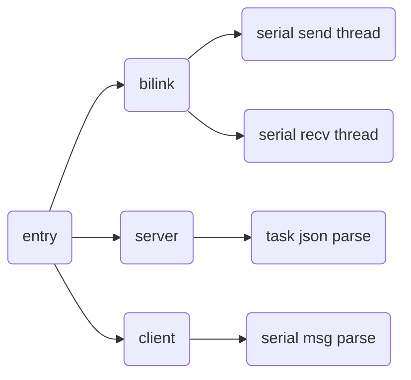

# introduction

Bilink protocol and serial protocol used in BOE gateway with i.mx6ull platform, written with C. 

## tree

> ```powershell
> ├── Debug
> │   ├── config
> │   │   ├── config.ini
> │   │   └── serial.ini
> │   ├── example
> │   │   └── subdir.mk
> │   ├── makefile
> │   ├── objects.mk
> │   ├── serialserver.sock
> │   ├── source
> │   │   ├── bi_client
> │   │   │   └── subdir.mk
> │   │   ├── bilink
> │   │   │   └── subdir.mk
> │   │   ├── bi_server
> │   │   │   └── subdir.mk
> │   │   ├── entry
> │   │   │   └── subdir.mk
> │   │   ├── inifun
> │   │   │   └── subdir.mk
> │   │   ├── json
> │   │   │   └── subdir.mk
> │   │   ├── manage
> │   │   │   └── subdir.mk
> │   │   ├── ots
> │   │   │   └── subdir.mk
> │   │   ├── packet
> │   │   │   └── subdir.mk
> │   │   ├── rts
> │   │   │   └── subdir.mk
> │   │   ├── serial
> │   │   │   └── subdir.mk
> │   │   ├── subdir.mk
> │   │   ├── task
> │   │   │   └── subdir.mk
> │   │   └── timer
> │   │       └── subdir.mk
> │   └── sources.mk
> ├── doc
> │   ├── readme.md
> │   └── 网关MCU与SOC之间串口通讯测试.md
> ├── example
> │   ├── entry_test.c
> │   ├── entry_test.h
> │   ├── ots_test.c
> │   ├── ots_test.h
> │   ├── rts_test.c
> │   └── rts_test.h
> ├── make-for-arm.sh
> └── source
>  ├── bi_client
>  │   ├── bi_client.c
>  │   └── bi_client.h
>  ├── bilink
>  │   ├── bilink.c
>  │   ├── bilink.h
>  │   ├── bilink_packet.c
>  │   └── bilink_packet.h
>  ├── bi_server
>  │   ├── bi_server.c
>  │   └── bi_server.h
>  ├── config.h
>  ├── entry
>  │   ├── entry.c
>  │   └── entry.h
>  ├── entrydef.h
>  ├── inifun
>  │   ├── inirw.c
>  │   └── inirw.h
>  ├── main.c
>  ├── ots
>  │   ├── ots.c
>  │   └── ots.h
>  ├── packet
>  │   ├── frame.h
>  │   ├── packet.c
>  │   └── packet.h
>  ├── payload.h
>  ├── rts
>  │   ├── rts.c
>  │   └── rts.h
>  ├── serial
>  │   ├── serial.c
>  │   └── serial.h
>  ├── task
>  │   ├── task.c
>  │   └── task.h
>  └── timer
>      ├── timer.c
>      └── timer.h
> ```
>

## modified 2019-03-21

new frame:




